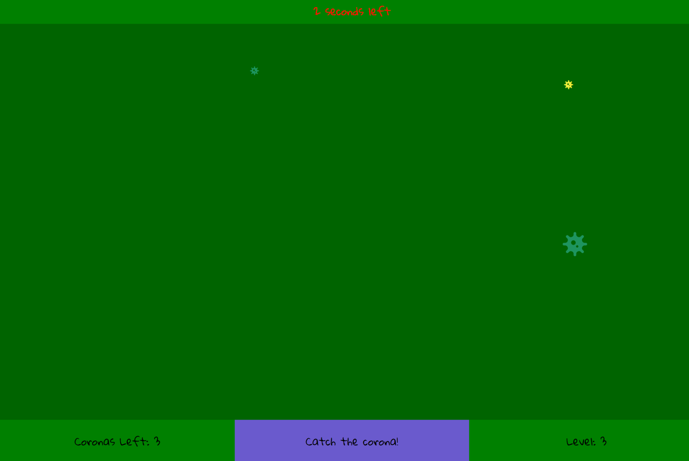

# Catch-a-The
Game catch corona
The premise of the game is that there are some things on the screen - say covid19 - and each time the user clicks one, it disappears.
But, when all the frogs disappear, the game goes to the next level - there should be more frogs on the screen now.

## Running the game

1. Clone the repo.
2. Run `npm install`.
3. Open 'index.html' in your browser
4. Catch all covids!

## Techstack
1. HTML + CSS
2. Grid
3. JS:
  a)Basics
  b)Callbacks
  c)Arrow functions
  d)this
4. DOM
5. jQuery
6. DOM Traversal
7. Data Flow
